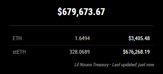

# MMM-LilNounsTreasury

A MagicMirror² module that displays the current value of the Lil Nouns DAO Treasury, including ETH and various ERC20 token balances.

## About Lil Nouns DAO

Lil Nouns is a spin-off project inspired by Nouns DAO, featuring daily auctions of NFTs with a more accessible price point. The Lil Nouns Treasury (0xd5f279ff9EB21c6D40C8f345a66f2751C4eeA1fB) holds the funds collectively owned by all Lil Noun holders, used to fund projects approved through governance.

## Screenshots



## Features

- Real-time display of Lil Nouns Treasury total value
- Shows ETH balance and value
- Displays balances and values of major tokens in the treasury:
  - stETH (Staked Ether)
  - USDC (USD Coin)
  - rETH (Rocket Pool ETH)
  - WETH (Wrapped Ether)
  - wstETH (Wrapped Staked Ether)
- Configurable update interval
- Support for USD and IDR currency display
- Option to show/hide token balances
- Rate-limited API calls to prevent throttling
- Error handling and graceful fallbacks

## Installation

1. Navigate to your MagicMirror's `modules` folder:
```bash
cd ~/MagicMirror/modules
```

2. Clone this repository:
```bash
git clone https://github.com/XppaiCyberr/MMM-LilNounsTreasury.git
```

3. Install the required dependencies:
```bash
cd MMM-LilNounsTreasury
npm install
```

## Configuration

Add the following configuration block to the `modules` array in your `config/config.js` file:

```javascript
{
    module: "MMM-LilNounsTreasury",
    position: "top_right", // Change this to your desired position
    config: {
        updateInterval: 300000, // Update every 5 minutes
        address: "0xd5f279ff9EB21c6D40C8f345a66f2751C4eeA1fB", // Lil Nouns Treasury address
        apiKey: "YOUR_ALCHEMY_API_KEY", // Your Alchemy API key
        currency: "usd", // "usd" or "idr"
        maxTokenDisplay: 10, // Maximum number of tokens to display
        showBalance: true, // Whether to show token balances
        targetTokens: [
            {
                address: "0xae7ab96520de3a18e5e111b5eaab095312d7fe84", // stETH
                coingeckoId: "staked-ether"
            },
            // ... other tokens
        ]
    }
}
```

### Configuration Options

| Option | Type | Default | Description |
|--------|------|---------|-------------|
| `updateInterval` | Number | 300000 | How often to update the data (in milliseconds) |
| `address` | String | "0xd5f279ff9EB21c6D40C8f345a66f2751C4eeA1fB" | The Ethereum address to monitor |
| `apiKey` | String | "" | Your Alchemy API key |
| `currency` | String | "usd" | Display currency ("usd" or "idr") |
| `maxTokenDisplay` | Number | 10 | Maximum number of tokens to display |
| `showBalance` | Boolean | true | Whether to show token balances |
| `targetTokens` | Array | [...] | Array of token configurations to monitor |


## Dependencies

- `axios`: For making HTTP requests
- `node_helper`: MagicMirror² node helper module

## API Requirements

This module requires an Alchemy API key to function. You can get one by:
1. Going to [Alchemy's website](https://www.alchemy.com/)
2. Creating an account
3. Creating a new app
4. Copying your API key

## Styling

The module includes a CSS file (`MMM-LilNounsTreasury.css`) that provides a clean and modern look. You can customize the styling by modifying this file.

## Troubleshooting

If you encounter issues:

1. Check that your Alchemy API key is valid
2. Verify that the treasury address is correct
3. Ensure your Magic Mirror has internet access
4. Check the Magic Mirror logs for any error messages

## Contributing

Feel free to submit issues and enhancement requests!

## License

MIT License - See LICENSE file for details 